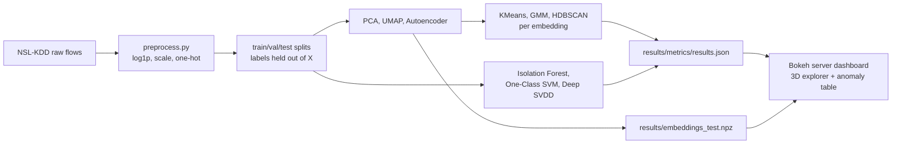
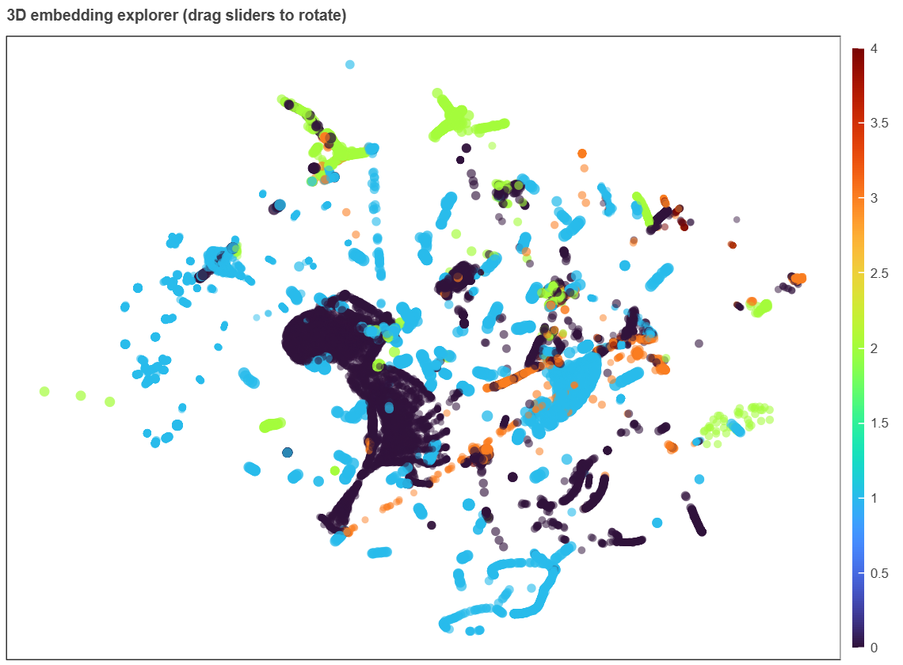

# 🛡️ Unsupervised Network Intrusion Detection


> **An unsupervised, label-blind benchmark of network intrusion detection, comparing nine
> methods across dimensionality reduction, clustering, and anomaly detection on the same data
> and the same metrics, explored live through a 3D Bokeh dashboard.**

---

## 🎯 Executive Summary

Supervised intrusion detection has a labeling problem. Attack labels are scarce, attacks evolve
faster than labeling pipelines can keep up, and a classifier trained on known signatures is, by
construction, blind to the ones it has never seen. This project asks a harder question instead:
**how well can you flag malicious network flows without ever showing a model a single attack
label?**

It benchmarks the full unsupervised toolbox on [NSL-KDD](https://www.unb.ca/cic/datasets/nsl.html)
network flow data: **PCA, UMAP, t-SNE and a custom autoencoder** for dimensionality reduction,
**KMeans, Gaussian Mixtures and HDBSCAN** for clustering, and **Isolation Forest, One-Class SVM
and Deep SVDD** for anomaly detection. Every method is tuned with **Optuna**, evaluated on
identical train/test splits with identical metrics, and explored live through a **Bokeh server**
dashboard with a genuinely rotatable 3D embedding view linked to an anomaly drill-down table.

The problem is genuinely hard, not just unfamiliar. Reduction, clustering and anomaly detection
each optimize a different objective, so there is no single "best" method, only trade-offs
reported side by side (ROC-AUC, PR-AUC, F1, ARI/NMI, silhouette) instead of one leaderboard
number. Attack categories are severely imbalanced, DoS floods are common and statistically loud
while R2L/U2R attacks are rare and can look, feature-wise, close to normal sessions, which is
exactly where the per-attack-category breakdown in [docs/results.md](docs/results.md) matters.
And NSL-KDD mixes near-binary flags, bounded rate features and byte/duration counts spanning
orders of magnitude, handled deliberately rather than left to a default scaler (see *Key
Engineering Decisions* below).

Labels are used for exactly two things, both stated explicitly rather than left implicit:
selecting hyperparameters on a held-out validation slice, and scoring the final test-split
metrics. Every model is fit without ever seeing a label. See
[docs/methodology.md](docs/methodology.md) for the full reasoning.

## 🏗️ Architecture



Every Optuna study is scored on a labeled validation slice carved from *training* data only, the
test split stays untouched until final scoring. See
[docs/architecture.md](docs/architecture.md) for the full data-flow diagram, the
fully-unsupervised vs. semi-supervised training regime split, and the dashboard's client/server
callback architecture.

## 📊 Dashboard

The dashboard is a genuine **Bokeh server** app (`bokeh serve`, not a static export): a rotatable
3D embedding scatter, drag two sliders and the rotation runs entirely client-side via `CustomJS`
for a responsive feel, linked to an anomaly drill-down table where box/lasso-selecting points
filters the table and vice versa. It supports live switching between PCA, UMAP, Autoencoder and
t-SNE embeddings, four independent anomaly scores, and an adjustable "flag top X%" threshold.



*The 3D scatter above is a static capture of the live view: 22,544 NSL-KDD test flows embedded via
UMAP, colored by ground-truth attack category (0=normal, 1=dos, 2=probe, 3=r2l, 4=u2r), rotatable
and linked to the anomaly table in the running app. See Installation below to run it yourself.*

## ⚙️ Installation & Usage

**1. Clone and set up the environment:**

```bash
git clone https://github.com/fragompul/unsupervised-anomaly-network-intrusion.git
cd unsupervised-anomaly-network-intrusion
python -m venv .venv
.venv/Scripts/activate   # .venv/bin/activate on Linux/Mac
pip install -e ".[dev]"
```

**2. Run the full benchmark** (downloads NSL-KDD automatically, no account or API key needed,
CPU-only and auto-detects CUDA if available):

```bash
python -m ids_anomaly.cli run --trials 25 -v
```

This writes `results/metrics/results.json` (every metric in `docs/results.md`) and
`results/embeddings_test.npz` (what the dashboard reads). HPO trials run in parallel across your
CPU cores automatically, pass `--jobs` to override.

**3. Launch the dashboard:**

```bash
bokeh serve --show dashboard/app.py
```

**4. Run tests and lint:**

```bash
pytest --cov=ids_anomaly
ruff check .
```

## 📈 Key Results

See [docs/results.md](docs/results.md) for the full comparison tables: every reduction ×
clustering combination, all four anomaly detectors, per-attack-category detection rates, and
cross-method consensus analysis. Headline numbers below come from the actual run this repository
ships with.

<!-- RESULTS_SUMMARY_START -->
| Method | Regime | ROC-AUC | PR-AUC |
|---|---|---|---|
| Isolation Forest | unsupervised | 0.879 | 0.859 |
| **One-Class SVM** | semi-supervised | **0.968** | **0.958** |
| Deep SVDD | semi-supervised | 0.948 | 0.940 |
| Autoencoder reconstruction | semi-supervised | 0.961 | 0.947 |

**Every semi-supervised detector beats the fully-unsupervised Isolation Forest by a wide margin.**
On NSL-KDD, a curated attack-free training window is worth more than any within-method
hyperparameter choice, a real, actionable answer, not a foregone conclusion (see
[docs/results.md](docs/results.md#anomaly-detection-head-to-head)).

For clustering, the autoencoder embedding + HDBSCAN gives the best agreement with attack
categories (ARI 0.354, NMI 0.484) of all nine reduction × clustering combinations tested. Across
every detector, **R2L is the shared blind spot**: 77.3% of R2L attacks are missed by all four
independently trained detectors at once, strong evidence the limitation sits in the feature
representation, not in any one model's capacity, while the rarest category, U2R (n=67), is
detected best by every method (58-64%). Full tables, per-category breakdowns and the cross-method
consensus analysis: [docs/results.md](docs/results.md).
<!-- RESULTS_SUMMARY_END -->

## 🔑 Key Engineering Decisions

- **NSL-KDD over CICIDS2017.** CICIDS2017, the more modern and higher-fidelity choice, was
  evaluated first, but its official host gates the download behind a form requiring name, email,
  organization and country. Submitting personal data to a third-party site for a portfolio
  project wasn't worth it. NSL-KDD is a well-established, non-trivial alternative distributed
  without any access gate, and its test split's held-out novel attack types are actually a good
  fit for testing unsupervised generalization anyway.
- **`log1p` before scaling, not scaling alone.** NSL-KDD's byte/count columns span orders of
  magnitude, so standardizing them raw still leaves outlier-heavy tails that dominate every
  Euclidean-distance method (KMeans, UMAP, RBF-kernel SVM). `log1p` first, then scale, applied
  only to the skewed count/byte columns, not to already-bounded rate features or flags (see
  `src/ids_anomaly/data/preprocess.py`).
- **Two training regimes, compared explicitly, not blended.** KMeans, GMM, HDBSCAN and Isolation
  Forest fit on the full unlabeled, attack-contaminated training data, the only regime that
  matches production. One-Class SVM, Deep SVDD and the autoencoder fit on a normal-only subset,
  the classical one-class regime those methods were designed for. Both are scored on the same
  test split, so the comparison is honest about which assumption each method depends on.
- **Bias-free Deep SVDD, not a naive implementation.** Following Ruff et al. (2018) exactly:
  bias-free linear layers plus L2 weight decay to block the trivial "collapse to a constant"
  solution, with the encoder pretrained as a bias-free autoencoder first. A naive Deep SVDD
  implementation without these safeguards routinely collapses during training.
- **Parallelized Optuna HPO after profiling, not upfront.** The first full run showed UMAP HPO
  taking minutes per trial, single-threaded, on a 16-core machine sitting mostly idle. Every
  objective's inner work (BLAS, numba-jitted UMAP, PyTorch) releases the GIL, so switching to
  threaded Optuna trials, with per-trial estimators pinned to `n_jobs=1` to avoid nested
  oversubscription, gave a large real speedup, documented in `src/ids_anomaly/pipeline.py` rather
  than silently reverted to serial.
- **A hand-rolled 3D rotation instead of a Three.js dependency.** Bokeh has no native 3D scatter.
  Rather than pull in a Three.js/WebGL extension (a build step, a Node.js dependency, more
  failure surface for a single-file `bokeh serve` app), rotation is a plain orthographic
  projection with a depth-based size/alpha cue, computed in about 30 lines of `CustomJS` shared
  with an equivalent NumPy implementation for the initial server-side render (see
  `dashboard/projection.py`). No build step, no extra runtime dependency, still genuinely
  interactive.
- **HDBSCAN's "all noise" result on a single blob is not a bug.** Confirmed against
  scikit-learn's own `HDBSCAN` implementation while writing tests: a single, unimodal Gaussian
  blob has no density valley for stability-based cluster selection to split on. Documented in
  `tests/test_clustering.py` rather than "fixed" by quietly picking different test data.

## 📂 Project Structure

```
unsupervised-anomaly-network-intrusion/
├── src/ids_anomaly/
│   ├── data/            # download, schema, label-blind preprocessing
│   ├── reduction/         # PCA, UMAP, t-SNE, autoencoder
│   ├── clustering/         # KMeans, GMM, HDBSCAN
│   ├── anomaly/             # Isolation Forest, One-Class SVM, Deep SVDD
│   ├── evaluation/           # metrics, cross-method error analysis
│   ├── hpo/                   # Optuna search spaces
│   ├── pipeline.py              # orchestrates the full run
│   └── cli.py                    # `python -m ids_anomaly.cli run`
├── dashboard/            # Bokeh server app (3D explorer + anomaly table)
├── notebooks/              # exploration + docs/ figure generation only
├── tests/                    # pytest, network-free (synthetic fixture)
├── docs/                        # methodology, architecture, results, limitations
└── .github/workflows/ci.yml       # ruff + pytest on every push
```

See [docs/architecture.md](docs/architecture.md) for the full data-flow diagram.

## 📄 Documentation

- [docs/problem_statement.md](docs/problem_statement.md): why unsupervised, why this is hard
- [docs/methodology.md](docs/methodology.md): preprocessing, label usage, splits, every method
- [docs/architecture.md](docs/architecture.md): data flow, training regimes, dashboard design
- [docs/experiments.md](docs/experiments.md): exact Optuna search spaces and trial counts
- [docs/results.md](docs/results.md): full comparison tables and figures
- [docs/limitations.md](docs/limitations.md): honest limitations and future work

## 🧠 Tech Stack

- **Languages:** Python (NumPy, Pandas, SciPy)
- **Modeling:** scikit-learn, PyTorch, UMAP, HDBSCAN
- **Hyperparameter optimization:** Optuna
- **Dashboard:** Bokeh server
- **Quality:** pytest, ruff, GitHub Actions CI
- **Dataset:** NSL-KDD (Tavallaee et al., 2009)

## 📜 License

MIT, see [LICENSE](LICENSE).

---

## 👤 Author

**Francisco Javier Gómez Pulido**
AI Lead at Aapex. AI Lead & MLOps Architect specialized in building scalable architectures, data
science pipelines, and generating real business impact through production-grade artificial
intelligence. Holds a Double Degree in Mathematics and Computer Science and a Master's degree in
Artificial Intelligence.

📫 **Let's connect:**
* **LinkedIn:** [linkedin.com/in/frangomezpulido](https://www.linkedin.com/in/frangomezpulido)
* **GitHub:** [github.com/fragompul](https://github.com/fragompul)
* **Email:** [frangomezpulido2002@gmail.com](mailto:frangomezpulido2002@gmail.com)
