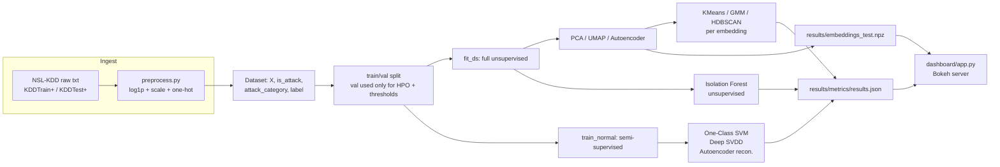
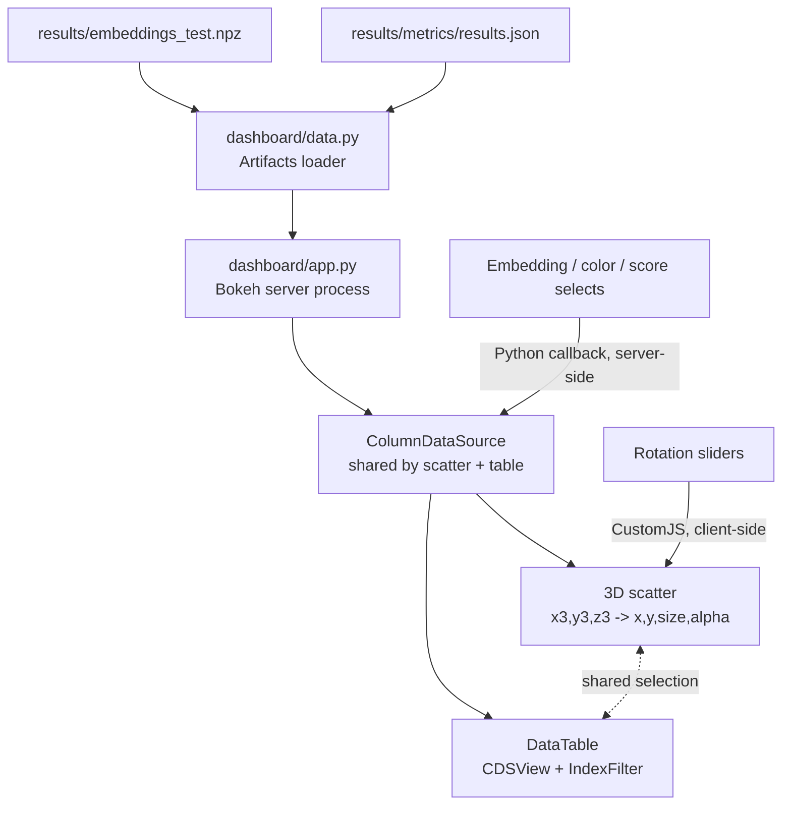

# Architecture

## Package layout

```
src/ids_anomaly/
├── data/            # download, schema, preprocessing (label-blind feature pipeline)
├── reduction/        # PCA, UMAP, t-SNE, autoencoder
├── clustering/        # KMeans, GMM, HDBSCAN
├── anomaly/           # Isolation Forest, One-Class SVM, Deep SVDD
├── evaluation/         # scoring metrics, cross-method error analysis
├── hpo/                # Optuna search spaces, one objective function per method
├── pipeline.py          # orchestrates the full run, writes results/
└── cli.py                # `python -m ids_anomaly.cli run`

dashboard/            # standalone Bokeh server app, reads results/ only
tests/                 # pytest, network-free (synthetic NSL-KDD fixture)
notebooks/              # exploration + docs/assets figure generation only
```

No notebook contains business logic: every model, metric, and transform lives in `src/`, unit
tested independently of the full pipeline run.

## Data flow



## Two training regimes, compared explicitly

| Regime | Methods | Trained on | Rationale |
|---|---|---|---|
| **Fully unsupervised** | KMeans, GMM, HDBSCAN, Isolation Forest | `fit_ds` (unlabeled, attack-contaminated) | The only regime that matches production: you cannot assume incoming traffic is attack-free. |
| **Semi-supervised (one-class)** | One-Class SVM, Deep SVDD, Autoencoder | `train_normal` (label == normal) | The classical setting these methods were designed and theoretically motivated for; assumes a curated attack-free training window. |

Both regimes are scored on the same untouched test split, so results directly answer: *does
having a clean training window actually help, for this data and these methods?* (see
[results.md](results.md)).

## Dashboard architecture



Rotation is deliberately split from every other control: dragging a slider must feel
instantaneous, so the 3D-to-2D projection runs entirely in the browser via `CustomJS` against
data already sitting in the `ColumnDataSource`. Switching embeddings, recoloring, or moving the
anomaly threshold is infrequent enough that a server round-trip (recomputing NumPy arrays in
Python) is simpler to reason about and plenty fast. See
[dashboard/projection.py](../dashboard/projection.py) for the shared Python/JS projection math.

## Visual design

Three layers, each reaching a different part of the rendered page:

* **`dashboard/templates/index.html`** -- a Jinja2 template overriding only Bokeh's `preamble`
  block (page fonts, background gradient, scrollbar, and hover-tooltip CSS). Bokeh only
  auto-discovers `templates/index.html` for directory-style apps (a `main.py`); a single-file
  `bokeh serve app.py` has to load and assign it explicitly via `curdoc().template`.
* **`dashboard/theme.py`: `DASHBOARD_THEME`** -- a `bokeh.themes.Theme` applied via
  `curdoc().theme`, styling every figure's background, grid, axes and legend. Only reaches
  plot-level models: `bokeh.plotting.figure()` returns an instance of the lowercase `figure`
  class (a `Plot` subclass), not `Figure` -- theme keys have to target `"Plot"`, a real gotcha
  documented in the module itself after a first attempt silently did nothing.
* **Per-widget `stylesheets`** (also in `theme.py`) -- `Select`, `Slider` and `DataTable` render
  inside their own shadow DOM, which neither the page-level CSS nor the `Theme` can reach.
  Bokeh 3's `model.stylesheets` injects scoped CSS directly into that shadow root, which is how
  the controls and results table pick up the dark palette.

Attack categories get a hand-picked, semantically stable color (normal=cyan, dos=rose,
probe=amber, r2l=violet, u2r=magenta) applied as a precomputed hex-string column rather than a
`linear_cmap`, so the legend swatches and the actual point colors are guaranteed to agree; the
fine-grained `label` field (dozens of distinct values) falls back to an evenly-spaced HSL sweep
instead of hand-picking dozens of colors.
