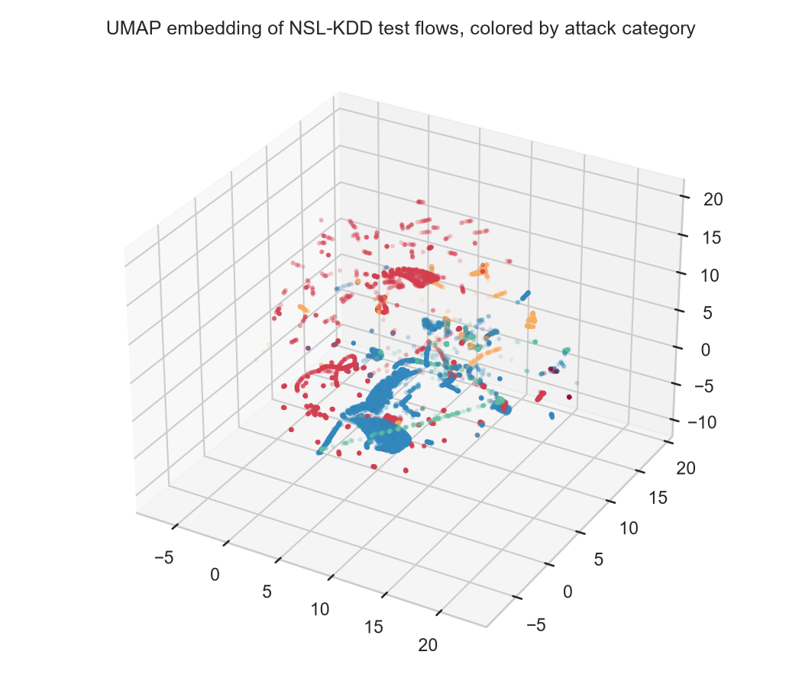
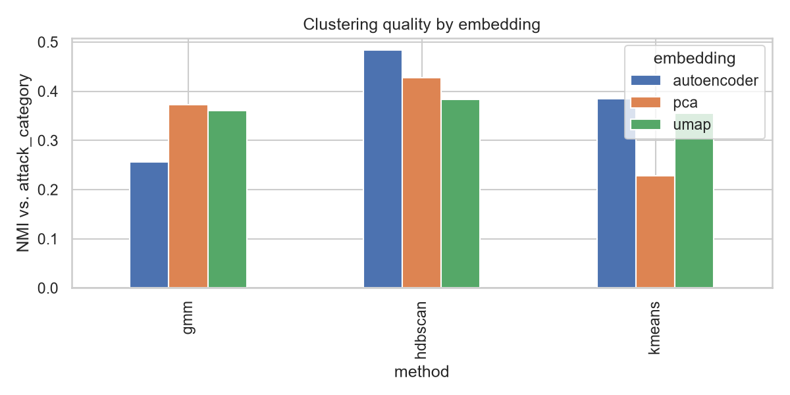
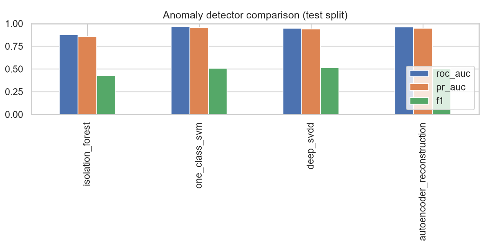
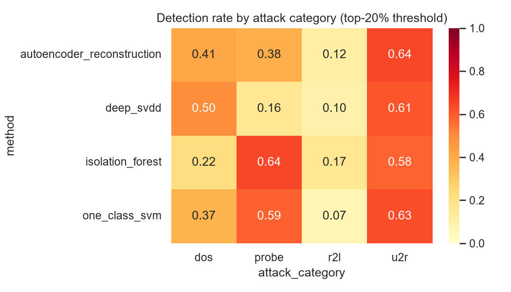

# Results

All numbers below come from `results/metrics/results.json`, produced by
`python -m ids_anomaly.cli run --trials 25` and regenerable byte-for-byte with the same command
(seeded throughout: `random_state=42`, `TPESampler(seed=42)`). Figures are generated by
`notebooks/02_figures.ipynb` into `docs/assets/`.

## Dataset summary

| | Train | Test |
|---|---|---|
| Rows | 125,973 | 22,544 |
| Attack fraction | 46.5% | 56.9% |
| Features (after encoding) | 122 | 122 |

Note the test split is *majority attack* (56.9%), unusual for an anomaly-detection setting where
anomalies are normally rare. This matters when reading the F1 numbers below: flagging the "top
20%" most anomalous flows is, on this split, a conservative operating point relative to true
prevalence, not an aggressive one.

## Dimensionality reduction

Three principal components capture only ~44% of variance. PCA is a linear projection of a feature
space with genuinely non-linear structure (one-hot categoricals, saturating rate features), so
this is expected, not a bug, and is exactly why UMAP and the autoencoder are worth comparing
against it rather than assuming PCA is "good enough."

| Embedding | Best hyperparameters | Downstream NMI (val) |
|---|---|---|
| UMAP | `n_neighbors=50`, `min_dist=0.084` | 0.347 |
| Autoencoder | `latent_dim=8`, hidden=(96, 16), `lr=9.0e-4` | 0.988 (val ROC-AUC of reconstruction error) |

UMAP's HPO picked the *largest* allowed `n_neighbors` (50, the upper bound of the search space),
suggesting a wider neighborhood consistently helped the downstream clustering proxy on this data;
widening that search range is a natural follow-up (see [limitations.md](limitations.md)).

## Clustering (per embedding)

| Embedding | Method | ARI | NMI | Silhouette | n clusters |
|---|---|---|---|---|---|
| PCA | KMeans | 0.191 | 0.228 | 0.631 | 2 |
| PCA | GMM | 0.383 | 0.372 | 0.489 | 12 |
| PCA | HDBSCAN | 0.337 | 0.428 | 0.658 | 15 |
| UMAP | KMeans | 0.236 | 0.355 | 0.481 | 10 |
| UMAP | GMM | 0.176 | 0.361 | 0.411 | 20 |
| UMAP | HDBSCAN | 0.187 | 0.384 | 0.701 | 25 |
| Autoencoder | KMeans | 0.354 | 0.385 | 0.539 | 8 |
| Autoencoder | GMM | 0.281 | 0.256 | 0.365 | 4 |
| Autoencoder | HDBSCAN | **0.354** | **0.484** | 0.655 | 16 |

The autoencoder embedding gives the best external agreement with attack categories (HDBSCAN: ARI
0.354, NMI 0.484), PCA is a close second on internal quality (highest silhouette for KMeans,
0.631), and UMAP, despite topping the internal-metric-adjacent HPO proxy at tuning time, does not
translate that into the best final ARI/NMI here. Read together, this says the metric used to
*tune* an embedding (NMI of a downstream GMM(5), a cheap validation proxy) does not perfectly
predict which embedding *scores best* under the full clustering sweep at test time, a real
finding, not a contradiction to paper over. GMM's optimizer failed to converge on a handful of
`(n_components, covariance_type)` combinations during HPO (`ValueError: ill-defined empirical
covariance`, a known GMM failure mode on small/collapsed clusters); Optuna's `TPESampler` simply
treats those trials as failed and moves on, so the reported best GMM configs are the
best-*among-converged* trials.

## Anomaly detection (head-to-head)

| Method | Regime | ROC-AUC | PR-AUC | F1 @ top-20% |
|---|---|---|---|---|
| Isolation Forest | unsupervised | 0.879 | 0.859 | 0.429 |
| One-Class SVM | semi-supervised | **0.968** | **0.958** | 0.507 |
| Deep SVDD | semi-supervised | 0.948 | 0.940 | **0.512** |
| Autoencoder reconstruction | semi-supervised | 0.961 | 0.947 | 0.505 |

The clearest result in this whole benchmark: every semi-supervised (normal-only-trained) detector
beats the fully-unsupervised Isolation Forest by a wide margin on both ROC-AUC and PR-AUC. On
NSL-KDD, having a curated attack-free training window is worth more than any hyperparameter
choice within a method. That is a real, actionable answer to the fully-unsupervised-vs-one-class
question this project set out to compare, not a foregone conclusion (see
[methodology.md](methodology.md#two-training-regimes)).

F1 sits far below ROC-AUC/PR-AUC for every method (0.43-0.51 vs. 0.86-0.97) because of the test
split's unusual majority-attack composition noted above: flagging only the top 20% caps recall at
roughly 20/56.9 ≈ 35% regardless of how well-ranked the scores are. This is a property of the
chosen operating point, not of the underlying discrimination, which is why both a threshold-free
metric (ROC-AUC/PR-AUC) and a threshold metric (F1) are reported side by side rather than either
one alone.

## Per-attack-category detection rate (at top-20% threshold)

| Method | dos | probe | r2l | u2r (n=67) |
|---|---|---|---|---|
| Isolation Forest | 0.219 | 0.644 | 0.167 | 0.582 |
| One-Class SVM | 0.368 | 0.589 | 0.066 | 0.627 |
| Deep SVDD | 0.500 | 0.161 | 0.096 | 0.612 |
| Autoencoder reconstruction | 0.411 | 0.385 | 0.117 | 0.642 |

Two findings hold across every single method, which is what makes them trustworthy rather than a
quirk of one detector:

* **R2L is the hardest category by far** (6.6%-16.7% detection across all four methods). This
  matches the standing hypothesis in [problem_statement.md](problem_statement.md): R2L attacks
  (guessed passwords, FTP writes) generate individual flows that are statistically close to
  normal sessions, exactly the failure mode unsupervised deviation-detection is expected to
  struggle with.
* **U2R is detected surprisingly well** (58.2%-64.2%) despite being the rarest category by a wide
  margin (67 test flows vs. 2,885-7,460 for the others). Read this together with
  [limitations.md](limitations.md): with only 67 examples the detection-rate estimate itself
  carries wide statistical uncertainty, but the *consistency* across four independently-trained
  methods suggests U2R flows really do carry a strong, shared statistical signature (privilege
  escalation attempts leave unusually shaped host-based feature values), not that this is noise.

Probe detection varies the most by method (16.1% for Deep SVDD vs. 64.4% for Isolation Forest),
the largest single method-vs-method gap in the whole table, and a concrete illustration of why
this project compares multiple detectors instead of shipping one.

False-positive flagging of genuinely normal traffic stays low across the board (0.7%-8.2%),
confirming none of these methods is simply flagging "the top 20% of everything" indiscriminately.

## Cross-method consensus

Percentile-rank-normalizes every method's raw scores onto a comparable [0, 1] axis, then compares
their top-20%-flagged sets (`evaluation/error_analysis.py`).

**Pairwise Jaccard overlap of flagged sets:**

| | Isolation Forest | One-Class SVM | Deep SVDD | Autoencoder |
|---|---|---|---|---|
| Isolation Forest | 1.000 | 0.244 | 0.117 | 0.131 |
| One-Class SVM | 0.244 | 1.000 | 0.360 | 0.567 |
| Deep SVDD | 0.117 | 0.360 | 1.000 | 0.491 |
| Autoencoder | 0.131 | 0.567 | 0.491 | 1.000 |

Isolation Forest is the outlier: it agrees least with every other method (Jaccard 0.12-0.24), a
direct fingerprint of it being the one fully-unsupervised detector in the group, trained on
different data under a different assumption than the other three. One-Class SVM and the
autoencoder agree the most (0.567) despite being architecturally very different (kernel boundary
vs. reconstruction error), suggesting they are picking up on overlapping structure in the
normal-only training signal rather than each finding an unrelated notion of "anomalous."

**Attacks every method jointly misses**, out of 12,833 total test attacks:

| | dos | probe | r2l | u2r | **total** |
|---|---|---|---|---|---|
| Missed by all 4 methods | 1,925 | 149 | 2,231 | 23 | **4,328 (33.7%)** |
| Missed by ≥3 of 4 methods | 3,774 | 1,051 | 2,536 | 25 | **7,386 (57.6%)** |

This is the sharpest confirmation of the R2L finding above: **77.3% of all R2L attacks (2,231 of
2,885) are missed by every single method**, not just the weakest one. When four independently
trained detectors, spanning trees, kernels, and two different neural architectures, all fail on
the same category, that is strong evidence the limitation is in the feature representation or the
category's inherent statistical similarity to normal traffic, not in any one model's capacity.
This is exactly the kind of finding a single-method benchmark would never surface.

## Wall-clock time

| Stage | Time |
|---|---|
| UMAP HPO (25 trials, 20k-row subsample) | 11.7 min |
| Autoencoder HPO (25 trials) | 19.1 min |
| Clustering HPO (KMeans+GMM+HDBSCAN × 3 embeddings) | 8.2 min |
| Isolation Forest HPO (25 trials) | 1.6 min |
| One-Class SVM HPO (25 trials) | 0.5 min |
| Deep SVDD (fixed config, pretrain + train) | 0.4 min |
| **Total (timed stages)** | **~41.5 min** |

Run on a CPU-only machine (`torch.cuda.is_available() == False`, 16 logical cores), no GPU
acceleration, with HPO trials parallelized across cores (`n_jobs=14`) via Optuna's threaded
executor. See the root README's *Key Engineering Decisions* for two real performance bugs found
and fixed while getting this run to a reasonable wall-clock time: UMAP's spectral initialization
silently falling back to a much slower solver on disconnected k-NN graphs, and HPO trials paying
full-dataset UMAP-fit cost when a bounded subsample ranks configurations just as well.

## Headline takeaways

1. **Training regime matters more than method choice.** Every normal-only-trained detector beats
   the fully-unsupervised Isolation Forest by a wide margin (ROC-AUC 0.95-0.97 vs. 0.88). If a
   clean training window is available, use it.
2. **R2L is the shared blind spot, and the cross-method consensus proves it isn't one weak
   detector's fault.** 77.3% of R2L attacks are missed by all four independently trained
   detectors at once. This is a property of the attack category looking statistically normal in
   this feature space, not a fixable hyperparameter problem.
3. **The autoencoder embedding, not UMAP, wins the final clustering comparison**, despite UMAP
   optimizing a similar-in-spirit proxy metric during its own HPO. Tuning proxy and final
   evaluation metric are not the same thing, and this benchmark is set up specifically to catch
   that gap rather than assume it away.
4. **U2R, the rarest category, is the best-detected by every method.** Encouraging, but reported
   with the caveat that n=67 is a small sample to draw strong conclusions from.
