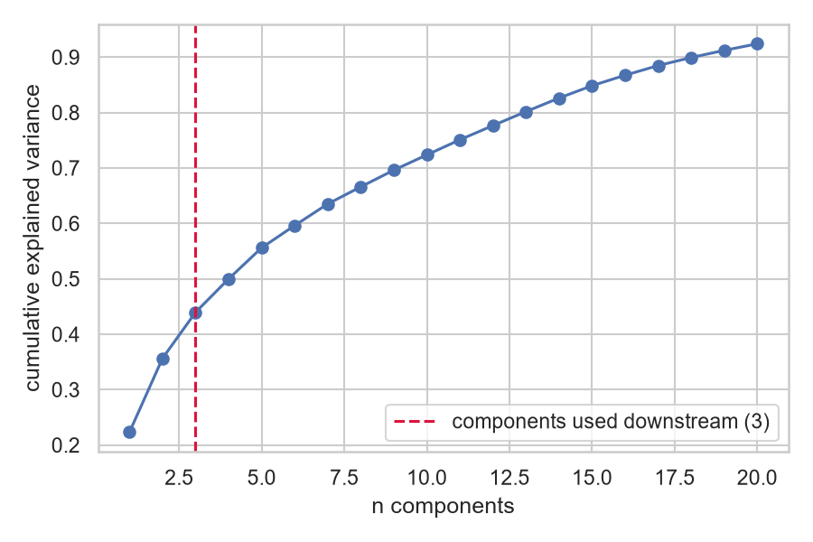

# Results

All numbers below come from `results/metrics/results.json`, produced by
`python -m ids_anomaly.cli run --trials 25` and regenerable byte-for-byte with the same command
(seeded throughout: `random_state=42`, `TPESampler(seed=42)`). Figures are generated by
`notebooks/02_figures.ipynb` into `docs/assets/`.

*Filled in once the full pipeline run completes, see the root README for the current status
badge. Placeholders below show the exact structure this section follows.*

## Dataset summary

| | Train | Test |
|---|---|---|
| Rows | 125,973 | 22,544 |
| Attack fraction | 46.5% | 56.9% |
| Features (after encoding) | 122 | 122 |

## Dimensionality reduction

| Embedding | Best hyperparameters | Downstream NMI (val) |
|---|---|---|
| UMAP | *TBD* | *TBD* |
| Autoencoder | *TBD* | *TBD* (val ROC-AUC of reconstruction error) |

## Clustering (per embedding)

| Embedding | Method | ARI | NMI | Silhouette | n clusters |
|---|---|---|---|---|---|
| PCA | KMeans | | | | |
| PCA | GMM | | | | |
| PCA | HDBSCAN | | | | |
| UMAP | KMeans | | | | |
| UMAP | GMM | | | | |
| UMAP | HDBSCAN | | | | |
| Autoencoder | KMeans | | | | |
| Autoencoder | GMM | | | | |
| Autoencoder | HDBSCAN | | | | |

## Anomaly detection (head-to-head)

| Method | Regime | ROC-AUC | PR-AUC | F1 @ top-20% |
|---|---|---|---|---|
| Isolation Forest | unsupervised | | | |
| One-Class SVM | semi-supervised | | | |
| Deep SVDD | semi-supervised | | | |
| Autoencoder reconstruction | semi-supervised | | | |

## Per-attack-category detection rate (at top-20% threshold)

| Method | dos | probe | r2l | u2r |
|---|---|---|---|---|
| Isolation Forest | | | | |
| One-Class SVM | | | | |
| Deep SVDD | | | | |
| Autoencoder reconstruction | | | | |

*(Read this table together with [limitations.md](limitations.md): U2R has very few training
examples, so its detection-rate estimate carries wide uncertainty regardless of method.)*

## Cross-method consensus

Pairwise Jaccard overlap of each method's top-20%-flagged set, and the attack categories every
method jointly misses, see `evaluation/error_analysis.py`. *TBD.*

## Wall-clock time

| Stage | Time |
|---|---|
| UMAP HPO (25 trials) | |
| Autoencoder HPO (25 trials) + final fit | |
| Clustering HPO (×3 embeddings) | |
| Isolation Forest HPO | |
| One-Class SVM HPO | |
| Deep SVDD (fixed config) | |
| **Total** | |

Run on a CPU-only machine (`torch.cuda.is_available() == False`), no GPU acceleration.

## Headline takeaways

*TBD once numbers are in, written as an honest read of the actual table, not decided in
advance.*
